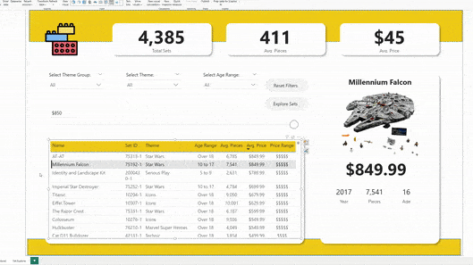

Special thanks to Maven Analytics tutorial that guided the dashboard build.
**Project:** Interactive Power Bi LEGO report

# interactive-lego-report-LP(learning project)
Interactive Power BI dashboard built from a LEGO dataset, showcasing interactive analysis of LEGO sets by theme, price, pieces, and age categories.

## Project Goal
Enable users to interactively explore LEGO sets, filtering by set ID, theme, and age, while reviewing summary KPIs and detailed information about each set.

## Overview
This project uses Power BI to transform and visualize a LEGO dataset. Data was cleaned and prepared in Power Query. 
Users can explore set details, analyze KPIs, and drill down by category and theme.

## Key Features
- **KPI Cards:** Total sets, average pieces, average price, average age.
- **Interactive Filters:** Slicers by theme, theme group, and age range. 
- **Dynamic Table:** Displays set details (name, ID, theme, pieces, price, age, and ranges). 
- **Image Tooltips:** Hover over sets to preview their images. 
- **Price Parameter Slicer:** Adjustable maximum price filter.  
- **Bookmarks & Reset Button:** One-click reset for all filters.
- **Decomposition Tree:** Break down total sets by category, theme, and name.

## Files in this repository
- `datasets/` — semi cleaned sample dataset used for the dashboard  
- `README.md` — this file  
- `screenshots/` — images of the dashboard for quick preview
- `README.md` — Power BI file
- `notes` — my note

## How to open in Power BI
1. Download LEGO Report_from Maven Analytics.pbix
2. Open in Power BI Desktop.
3. Interact with slicers, filters, and visuals to explore LEGO data.

## Design & UX notes
- Clean and simple layout with card KPIs at the top.
- Slicers grouped logically for theme, age, and price.
- Reset button for quick navigation.
- Decomposition tree for deeper analysis.
- Hover-enabled tooltips for images to improve user experience.

## Contact
Rowel Andrew Legaspi (Drew)  
- Maven Analytics: https://mavenshowcase.com/project/49301
- LinkedIn: https://www.linkedin.com/in/rowel-andrew-legaspi-289936241/
- Tableau Profile: https://public.tableau.com/app/profile/rowel.andrew.legaspi
